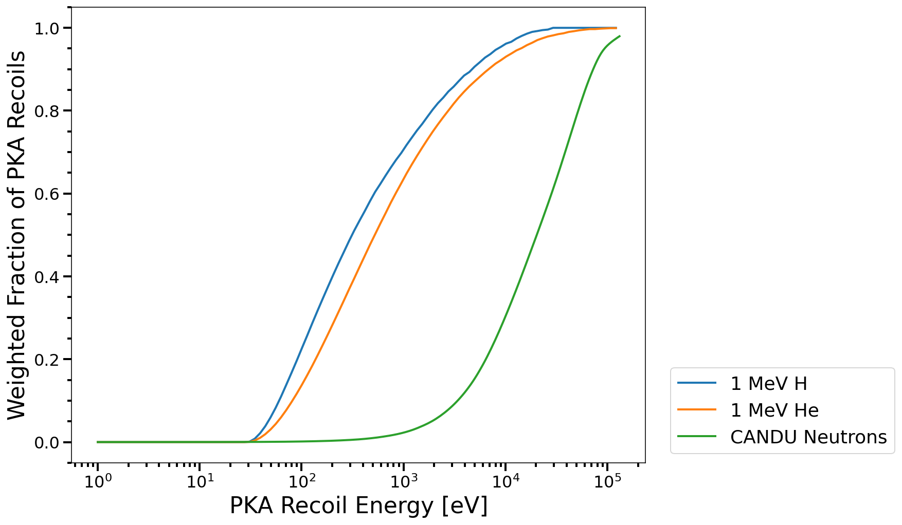

# srimpro
srimpro is a python library that contains many tools for the automated extracting, calculating, publication-quality plotting, and/or exporting of SRIM data for a wide range of purposes. SRIM is a popular software package used to simulate the irradiation of materials by energetic ions, but extracting data from its output files, performing calculations, and plotting data can be extremely time consuming. By automating these processes, srimpro aims to improve the speed and efficiency of SRIM data analysis. Additionally, srimpro contains advanced functions that enable SRIM to be used for a wider range of purposes than what has traditionally been available to researchers.
* srimpro reads data from SRIM output files using an updated version of [pysrim](https://github.com/costrouc/pysrim)
* most functions have several optional inputs to provide a wide range of utilities
* plot settings can be easily modified within each function to allow for full plot customization
* all functions are fully documented, and all code is fully commented

# Features
srimpro is designed to have a high ease of use. Most functions only require the `path` input (filepath to the folder containing the appropriate SRIM output files) to generate an output.
## Integration Functions
These functions are used to integrate under the profiles from SRIM to get total values. For example, the following code will set *vactot* and *novactot* to the total number of vacancies and replacements between depth x1 and x2 respectively:
```
vactot, novactot = totDisplacements(path, x1=x1, x2=x2)
```

## Basic SRIM Plots
These functions are used to generate publication-quality plots or export data to excel, specfically for the data commonly used from SRIM. These include plotting ion distribution and damage dose, energy deposition, and stopping power. For example, the following code will generate the plot shown below:
```
rangeAndDpa(path, fluence)
```


## Advanced SRIM Plots
These functions provide advanced utilities, making use of SRIM data that is typically highly difficult to obtain and perform calculations with, preventing it from being used in the field despite its importance. These functions automatically extract this data, perform the necessary calculations, and generate publication-quality plots. For example, the following code will generate the side and front views of the collision distribution shown below (either all recoils, are only the primary knock-ons such as in the example plots), which is useful for analyzing the spatial coupling of the inelastic thermal spike and collision processes:
```
collisionPlotDepth(path, x1, x2, scale='log')
collisionPlotXsection(path, x1, x2, scale='log')
```
-2000-ions-only-PKA-collisions.png)
-2000-ions-only-PKA-collisions.png)

Another important function can generate the combined damage dose and ion distribution plots shown below (damage dose from irradiation by multiple ion energies) which is useful for uniform irradiation studies, using the following code:
```
multiRangeAndDpa(paths, labels, fluence, plot_style='combined', ref_layer=2)
```
.png)
.png)

Another set of important functions can generate the normal or weighted primary recoil spectra plots shown below, which is useful for comparing irradiations by different particles (such as comparing ion and neutron irradiations), using the following code (for weighted spectra):
```
weightedRecoilSpectra(paths, labels, excelpath=excelpath)
```


# Installation
## Initial Installation
To install srimpro, Git must be installed first. To install git, follow the official [GitHub instructions](https://github.com/git-guides/install-git). After installing git, srimpro can be easily be installed using the following command in Anaconda Prompt or similar application:
```
pip install git+https://github.com/Noah-Miggs/srimpro.git
```
## Updating Installation
If an older version of srimpro was installed (i.e. a new release of srimpro was published after the initial install), the package will need to be manually updated. This can be done using the following command in Anaconda Prompt or similar application:
```
pip install --upgrade git+https://github.com/Noah-Miggs/srimpro.git
```

# Setup
After installing srimpro, all dependencies including pysrim should be automatically installed as well. srimpro requires updated versions of the *output.py*, *srim.py*, and *elementdb.py* files within pysrim to make it compatible with python 3.14, so the original files from pysrim must be manually replaced. See *srimpro Setup* in documentation for more details.

# Using srimpro in a python IDE
Once srimpro has been installed and setup, the library can be easily imported into a .py file to be used. For example, including the following code at the top of the .py file will allow all srimpro functions to be accessed:
```
import srimpro.functions as pro
```
